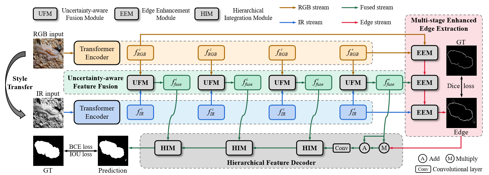
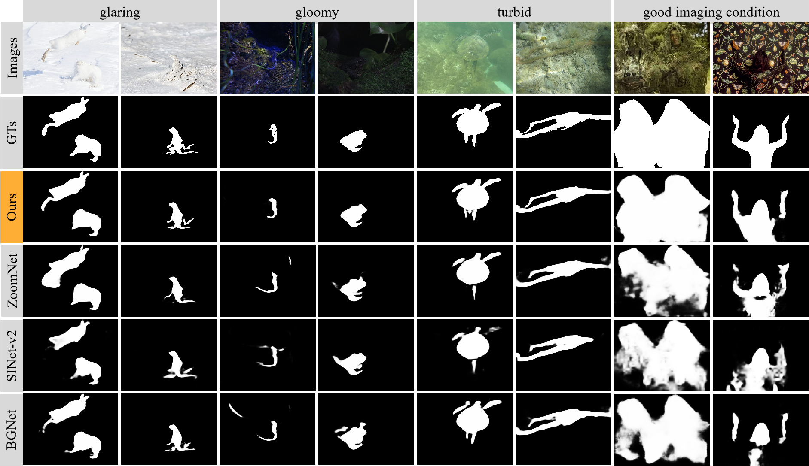

# (ICIP 2024) Camouflaged Object Detection via Style Transfer-based Data Augmentation
This repository is an official implementation of the ICIP 2024 paper [Camouflaged Object Detection via Style Transfer-based Data Augmentation](https://ieeexplore.ieee.org/abstract/document/10648134). The code will be released soon. 
  
  
 
